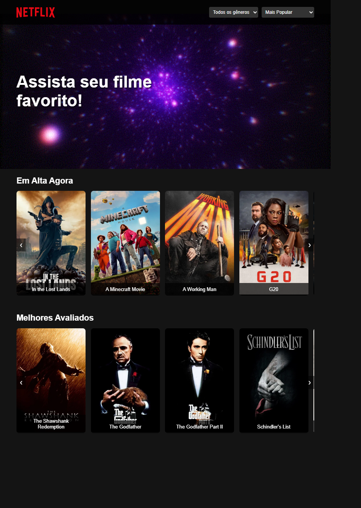

# 🎬 Netflix Clone - Interface Responsiva com HTML, CSS e JavaScript

Este projeto é um clone da interface inicial do **Netflix**, desenvolvido com foco em design responsivo, estrutura HTML semântica e consumo de API pública (TMDB). O objetivo é replicar uma plataforma conhecida para praticar e demonstrar habilidades em front-end moderno.

---

## 🔍 Demonstração

 <!-- Substitua pelo seu link ou GIF se tiver -->

Você pode acessar o projeto aqui: [🔗 Deploy no GitHub Pages](https://seuusuario.github.io/netflix-clone)

---

## 🧪 Funcionalidades

- ✅ Interface responsiva com HTML5 e CSS3 (Flexbox e Grid)
- ✅ Consumo da API do [TMDB](https://www.themoviedb.org/documentation/api)
- ✅ Listagem dinâmica de filmes e séries por categoria (tendências, populares, ação, comédia etc.)
- ✅ Barra de busca funcional (opcional)
- ✅ Efeitos de hover, dark mode e UI moderna

---

## 🚀 Tecnologias Utilizadas

| Tecnologia | Função |
|------------|--------|
| HTML5      | Estrutura do projeto |
| CSS3       | Estilização visual e responsividade |
| JavaScript | Lógica de consumo de API e renderização dinâmica |
| TMDB API   | Fonte de dados (filmes e séries) |
| Git e GitHub | Controle de versão e hospedagem |

---

## 🛠️ Como rodar o projeto localmente

1. Clone o repositório:
   ```bash
   git clone https://github.com/Thiago-Tertuliano/Netflix-Clone.git
